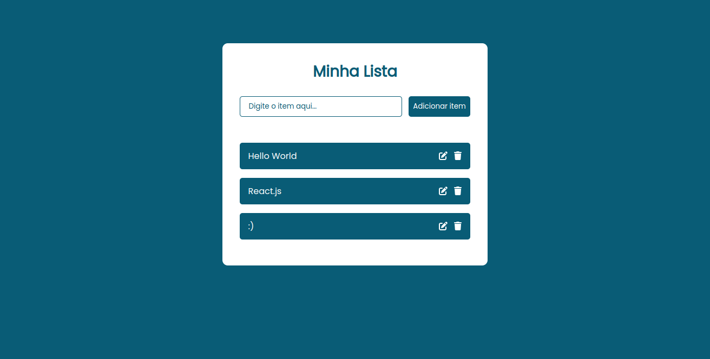

# TodoList ReactJS 📋



## Descrição do Projeto 📝

O TodoList ReactJS é um aplicativo de lista de tarefas simples desenvolvido em ReactJS. Ele permite que os usuários gerenciem suas tarefas diárias, incluindo adicionar, marcar como concluídas, editar e excluir tarefas. Este projeto é um exemplo de um aplicativo CRUD (Create, Read, Update, Delete).

## Demonstração Online 🌐

Confira o projeto em funcionamento [aqui](https://khalilbrito.github.io/todolist_reactjs/).

## Principais Tecnologias Utilizadas 🛠️

- **React**: O projeto é desenvolvido com o framework React, que é amplamente utilizado para criar interfaces de usuário modernas e responsivas.

- **JavaScript**: A linguagem de programação JavaScript é a base deste projeto, usada para criar a lógica de funcionamento da lista de tarefas.

- **CSS**: O CSS é usado para estilizar o aplicativo e torná-lo agradável visualmente, além de torná-lo responsivo.

- **FontAwesome**: A biblioteca FontAwesome é usada para adicionar ícones às tarefas, tornando a interface mais intuitiva.

## Como Usar 📦

Para utilizar este aplicativo de lista de tarefas, siga os passos abaixo:

1. Clone o repositório para a sua máquina:

   ```bash
   git clone https://github.com/KhalilBrito/todolist_reactjs.git
    ```

2. Navegue até o diretório do projeto:

   ```bash
   cd todolist_reactjs
   ```

3. Instale as dependências do projeto:

   ```bash
    npm install
    ```

4. Inicie o servidor de desenvolvimento:

   ```bash
    npm start
    ```

5. Abra o aplicativo no seu navegador:

   ```bash
    http://localhost:3000
    ```

## Funcionalidades ✨

O TodoList ReactJS oferece as seguintes funcionalidades:

- **Adicionar Tarefas:** Você pode adicionar novas tarefas à lista, digitando o nome da tarefa e pressionando "Adicionar item".

- **Marcar Tarefas:** Clique em uma tarefa para marcá-la como concluída. Clique novamente para desmarcar.

- **Editar Tarefas:** Para editar o nome de uma tarefa, clique no ícone de edição (lápis) ao lado dela. Faça as alterações necessárias e pressione Enter para salvar.

- **Excluir Tarefas:** Para excluir uma tarefa, clique no ícone de lixeira ao lado dela.

A interface intuitiva torna a gestão de tarefas simples e eficiente. Experimente todas as funcionalidades para organizar suas tarefas de forma eficaz!

## Estilos Responsivos 📱

O TodoList ReactJS foi projetado com estilos responsivos para garantir uma experiência de usuário agradável em diferentes dispositivos e tamanhos de tela. As características dos estilos responsivos incluem:

- **Compatibilidade com Dispositivos Móveis:** O aplicativo é otimizado para funcionar perfeitamente em smartphones e tablets, proporcionando uma experiência de usuário fluida em telas menores.

- **Layout Flexível:** Os componentes do aplicativo se ajustam automaticamente ao tamanho da tela, garantindo que as informações sejam exibidas de maneira legível e intuitiva.

- **Navegação Intuitiva:** Os controles e botões são dimensionados adequadamente para facilitar a interação em dispositivos sensíveis ao toque.

- **Adaptação a Telas Maiores:** O aplicativo também é adaptado para funcionar bem em monitores de desktop, aproveitando o espaço extra de tela.

Com estilos responsivos, o projeto e a oferece uma experiência consistente e agradável em qualquer dispositivo que você escolher usar.

## Contribuição 🤝

Você pode contribuir de várias maneiras:

- **Abra Issues:** Se encontrar algum problema ou tiver ideias para melhorias, sinta-se à vontade para abrir uma issue. Descreva o problema ou a ideia de forma clara e concisa.

- **Envie Pull Requests:** Se você deseja implementar alguma melhoria ou corrigir um problema existente, envie um pull request. Certifique-se de seguir as diretrizes de código e incluir uma descrição detalhada das alterações.

- **Teste e Comente:** Teste o aplicativo e forneça feedback sobre o funcionamento e a usabilidade. Comentários construtivos são valiosos.

- **Divulgue o Projeto:** Compartilhe o projeto com outras pessoas que possam se beneficiar ou contribuir de alguma forma.

A colaboração da comunidade é o que torna os projetos de código aberto tão poderosos. Sua contribuição é bem-vinda e apreciada!


